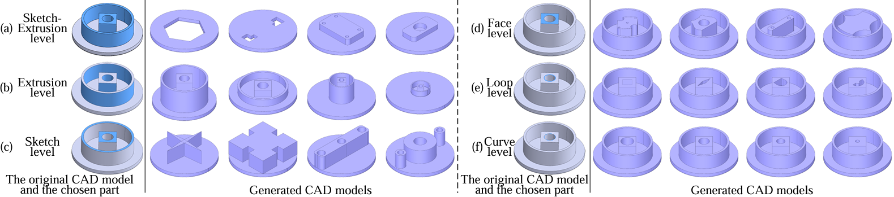
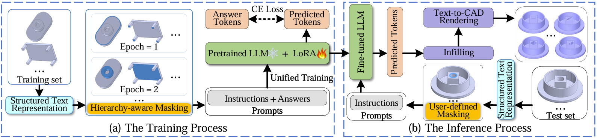

# FlexCAD
**[ICLR 2025] FlexCAD: Unified and Versatile Controllable CAD Generation with Fine-tuned Large Language Models** by *Zhanwei Zhang*, *Shizhao Sun*, *Wenxiao Wang*, *Deng Cai*, *Jiang Bian*.

[[Paper](https://arxiv.org/abs/2411.05823)][[Hugging Face](https://huggingface.co/microsoft/FlexCAD)]

FlexCAD aims at achieving controllable CAD generation across all CAD construction hierarchies. It takes an original CAD model along with the part the user intends to modify (highlighted in blude) as input, and generates multiple new CAD models with only the chosen part changed.



Figure (a) illustrates training process. Initially, a CAD model is converted into a structured text. Next, a hierarchy-aware masking strategy is proposed to mask a specific field in the text with a special mask token. This field is set differently at each epoch to reflect various hierarchies. Then, LLMs are fine-tuned to predict the masked field. 
Figure (b) presents inference process. The original CAD model is transformed into a structured text with a mask token replacing the part the user wants to change. The fine-tuned LLMs are provided with this masked text to generate diverse predictions, which are then converted into new CAD models by infilling and rendering.



## Installation
- Create a conda environment and install all the dependencies
```
conda env create -f environments.yaml
```
- After installation, activate the environment with
```
conda activate <env>
```

## Data preparation
- Download the processed data by [SkexGen](https://github.com/samxuxiang/SkexGen): [Google Drive link](https://drive.google.com/file/d/1so_CCGLIhqGEDQxMoiR--A4CQk4MjuOp/view).
```
gdown --id 1so_CCGLIhqGEDQxMoiR--A4CQk4MjuOp
```
- Convert the dicts to the sequences. Note ```train.pkl```, ```val.pkl``` and ```test.pkl``` should be converted separately. Circle_type: [ udlr, ldru, diam, or ]. 

```
python3 utils/convert.py --in_path <in_path_name> --out_path <out_path_name> --circle_type <circle_type_name>
```
For example:
```
python3 utils/convert.py --in_path ./cad_data/train_deduplicate_s.pkl --out_path ./cad_data/processed_data/train.pkl --circle_type ldru
```

## Training
Before starting training, make sure to register and download [the LLaMA 3 model](https://huggingface.co/meta-llama/Meta-Llama-3-8B) for fine-tuning.
- Run training with multiple GPUs. Change ```num_processes``` in ```ds_config.yaml``` to specify how many GPUs will be used.
```
CUDA_VISIBLE_DEVICES=<gpu_ids> accelerate launch --config_file ds_config.yaml finetune.py --run-name <run_name> --data-path <data_path> --eval-freq 200000 --save-freq 50000 --model_name <model_name>
```
For example: use Llama 3 8B as base model:
 ```
CUDA_VISIBLE_DEVICES=0,1,2,3 accelerate launch --config_file ds_config.yaml finetune.py --run-name llama3_8B --data-path ./cad_data/processed_data --eval-freq 200000 --save-freq 20000 --model-name 8B
```


- Run training with single GPU.
```
CUDA_VISIBLE_DEVICES=<gpu_id> python3 finetune.py --run-name <run_name> --data-path <data_path> --eval-freq 200000 --save-freq 20000 --model_name <model_name>
```
## Inference
Download our trained model weights for FlexCAD from [Hugging Face](https://huggingface.co/microsoft/FlexCAD).
- For conditional generation, run inference with
  (mask_type: [```unconditional```, ```cad```, sketch-extrusion(```es```), ```extrusion```, ```sketch```, ```face```, ```loop```, ```curve```]. When selecting 'curve', you can enable ```use_fixed_demo``` to customize the type and number of curves to generate as desired.)
```
CUDA_VISIBLE_DEVICES=<gpu_id> python3 sample.py --model_path <model_path> --num_samples <num_samples> --model_name <model_name> --data_path <data_path> --mask_type <mask_type>
``` 


The output should be a json file, where each line is a string representing a CAD design.
## Visualization
- Step 1: parse the generated string to CAD obj. The in_path should be set the same as the out_path in the inference. 
```
python3 utils/parser.py --in_path <in_path> --out_path <out_path>
```
- Step 2: convert generated CAD obj to stl format. Use timeout command to prevent occ hanging. The data_folder should be set the same as the out_path in step 1.
```
timeout 180 python3 utils/visual_obj.py --data_folder <data_folder>
```
- Step 3: render and visualize to images. The input_dir should be set the same as the data_folder in step 2. Note that this step only succeeds on Windows now.
```
python3 utils/cad_img.py --input_dir <input_dir> --output_dir <output_dir>
```
## Evaluation
- Uniformly sample 2000 points 
```
python utils/sample_points.py --in_dir <sample_dir> --out_dir pcd
```
- Evaluate performance 
```
python utils/eval_cad.py --fake <sample_dir> --real ../data/test_eval
```

## Citation
If you find our work useful in your research, please cite our paper:
```
@InProceedings{zhang2024flexcad,
  title={FlexCAD: Unified and Versatile Controllable CAD Generation with Fine-tuned Large Language Models},
  author={Zhang, Zhanwei and Sun, Shizhao and Wang, Wenxiao and Cai, Deng and Bian, Jiang},
  booktitle={ICLR},
  year={2025}
}
```

## Acknowledgement

Our code is partially based on [Skexgen](https://github.com/samxuxiang/SkexGen) and [Crystal-text-llm](https://github.com/facebookresearch/crystal-text-llm). 
We appreciate all the contributors for their awesome work.


## Contributing

This project welcomes contributions and suggestions.  Most contributions require you to agree to a
Contributor License Agreement (CLA) declaring that you have the right to, and actually do, grant us
the rights to use your contribution. For details, visit https://cla.opensource.microsoft.com.

When you submit a pull request, a CLA bot will automatically determine whether you need to provide
a CLA and decorate the PR appropriately (e.g., status check, comment). Simply follow the instructions
provided by the bot. You will only need to do this once across all repos using our CLA.

This project has adopted the [Microsoft Open Source Code of Conduct](https://opensource.microsoft.com/codeofconduct/).
For more information see the [Code of Conduct FAQ](https://opensource.microsoft.com/codeofconduct/faq/) or
contact [opencode@microsoft.com](mailto:opencode@microsoft.com) with any additional questions or comments.

## Trademarks

This project may contain trademarks or logos for projects, products, or services. Authorized use of Microsoft 
trademarks or logos is subject to and must follow 
[Microsoft's Trademark & Brand Guidelines](https://www.microsoft.com/en-us/legal/intellectualproperty/trademarks/usage/general).
Use of Microsoft trademarks or logos in modified versions of this project must not cause confusion or imply Microsoft sponsorship.
Any use of third-party trademarks or logos are subject to those third-party's policies.
